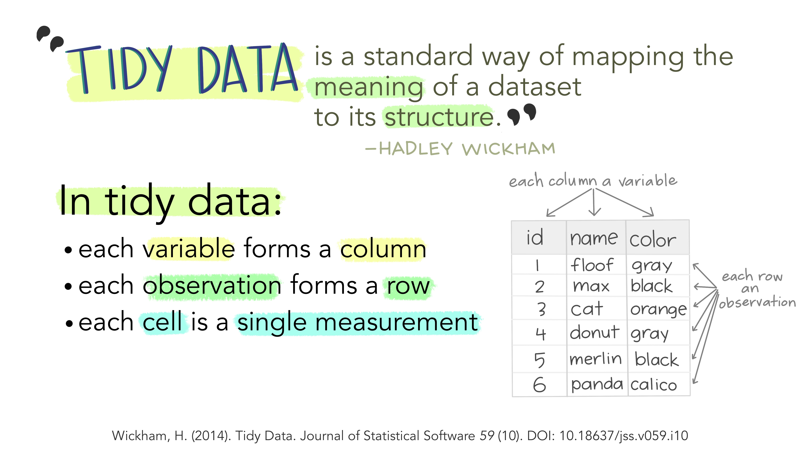

<!-- remove border around TOC and change colour -->
<style>
  #TOC {
    border: 0;
    }
  .list-group-item.active, .list-group-item.active:focus, .list-group-item.active:hover {
    background-color: #698b69;
    }
  .nav-pills>li>a:hover, .nav-pills>li>a:focus, .nav-pills>li.active>a, .nav-pills>li.active>a:hover, .nav-pills>li.active>a:focus{
    background-color: #698b69;
    }
</style>

***
## Before we begin

Please download the {aniMotum} package from R-Universe.

```{r aniMotum-download, eval = F}
# install from R-universe repository
install.packages("aniMotum", 
                 repos = c("https://cloud.r-project.org",
                 "https://ianjonsen.r-universe.dev"),
                 dependencies = TRUE)
```

This installs all Imported and Suggested R packages from CRAN and R-universe. If queried, answer Yes to install the source version. Note, if you haven’t installed {aniMotum} previously then installation of dependent packages may take a while, especially if many of them need to be compiled. You should only need to go through this once, subsequent installation of {aniMotum} updates will be much faster.

Alternatively you can download a binary version of aniMotum here: https://ianjonsen.r-universe.dev/aniMotum

For full instructions see the aniMotum homepage on GitHub: https://github.com/ianjonsen/aniMotum

# Introduction

The aim of this practical is to give you an understanding of the common approaches that are used to process and analyse animal movement data. We will be doing this in the R statistical framework and will introduce you to some commonly used R packages.

During this practical you will:

1. Load in an example data set of animal locations and explore the data with some preliminary plots
2. Produce a map of the study area in an appropriate spatial projection for the region
3. Load in an example dive summary data set and explore the data with some preliminary plots
4. Error correct and regularise the animal location data and combine them with dive summary data
5. Extract example environmental covariates and append them to the data frame  
6. Perform a preliminary statistical analysis to better understand the drivers of animal movement  

This practical will be based on the {tidyverse} style of R coding. Tidyverse is a collection of R packages designed for data science. The key for this practical is that by learning to structure our data in a 'tidy' way we can use the same tools in similar ways for different data sets. This helps to make our data processing and analysis reproducible.

If reproducible and open science is something you are interested in have a look at this paper from [Lowndes et al. 2017](https://www.nature.com/articles/s41559-017-0160) and this blog post on [Tidy Data for reproducibility, efficiency and collaboration](https://www.openscapes.org/blog/2020/10/12/tidy-data/).

&nbsp;
&nbsp;

<center>

{width=800px}

</center>

&nbsp;
&nbsp;

***

# Toolbox

During this practical you will become familiar with using pipes `|>` to perform data manipulations, using `ggplot` to generate publication quality figures, and using the {sf} package to handle spatial data. The {patchwork} package is a great way to stitch your plots together.

For more information on the {tidyverse} check out the Wickham & Grolemund book 'R for Data Science'.
You can access it for free online here: https://r4ds.had.co.nz

The project website can be accessed here: https://www.tidyverse.org

For more information on the {sf} project check out: https://r-spatial.github.io/sf/

For this practical you will need the following R packages in addition to {aniMotum}:

```{r install-packages, eval = F}
install.packages(
  c(
    "lubridate",
    "marmap",
    "patchwork",
    "raster",
    "rgdal"
    "rnaturalearth",
    "rnaturalearthdata",
    "sf",
    "tidyverse",
    "viridis",
    )
  )
```

I recommend opening a new session in R Studio, starting a new project, and creating an R script in this session.

This is a sensible way to curate and keep track of your files. It will be particularly useful when it comes to managing the data and analysis for your research projects. When you close R you will be able to reopen the session via the project and all your files will be loaded ready to continue the analysis. It also then becomes very easy to incorporate version control via GitHub if this is something you become interested in.

For specific instructions look at [Chapter 8](https://r4ds.had.co.nz/workflow-projects.html) in the R for Data Science. Bonus points if you also start to use the {here} package.

&nbsp;
&nbsp;

<center>

{width=400px}

</center>

&nbsp;
&nbsp;

***

# Background

In March 2019 I was part of an expedition to deploy Satellite Relay Data Loggers on harp seal pups in the Gulf of St Lawrence, Canada. These devices are satellite linked computers capable of recording a wide range of information and transmitting it via the Argos network. Here we will focus on the location data recorded by the Argos satellites when communicating with three of the tags.

Harp seals give birth on the sea ice when it is at it’s most southerly extent in late Winter/ early Spring. Females wean their pup after around 2 weeks. We deployed tags on pups that were approximately 3 weeks old, and tracked their movements as they left the sea ice and began their first migration north.

This work was published in Royal Society Open Science and is available Open Access here:

- Grecian WJ, Stenson GB, Biuw M, Boehme L, Folkow LP, Goulet PJ, Jonsen ID, Malde A, Nordøy ES, Rosing-Asvid A & Smout S (2022) Environmental drivers of population-level variation in the migratory and diving ontogeny of an Arctic top predator Royal Society Open Science 9: 211042 https://doi.org/10.1098/rsos.211042

We were joined on the ice by a team from Frozen Planet II. You can watch the episode on [iPlayer](https://www.bbc.co.uk/iplayer/episode/m001d847/frozen-planet-ii-series-1-6-our-frozen-planet).

&nbsp;
&nbsp;

<center>

{width=800px}

</center>

&nbsp;
&nbsp;

***

# Data
  
SMRU Satellite Relay Data Loggers (SRDLs) collect a wide range of information and transmit the data through the Argos satellite network.
In this practical we will be considering the location data and the dive summary data.

Data for 6 of these animals are available to you via GitHub, you can load this straight into R using the `read_csv` command:
  
`locs <- read_csv("https://raw.githubusercontent.com/jamesgrecian/BL5122-dev/master/data/hp6_diag.csv")`
`dives <- read_csv("https://raw.githubusercontent.com/jamesgrecian/BL5122-dev/master/data/hp6_summary.csv")`

The `locs` data frame is the "diag" data from the tags. This has columns containing information on the animal id, the date and time of the fix, the estimated quality of the argos location, the estimated longitude and latitude, as well as information on the error ellipses from the Argos Kalman Filter (a more detailed measure of the location quality).

The `dives` data frame is the "summary" data from the tags and contains 6 hourly summary information for all the dives performed by an individual.
Some of the information has been truncated for this practical, but there are columns containing the start time of the 6 hour period, the proportion of time an individual spent at the surface, diving, or hauled out, the number of dives finished during the period, the average dive depth, maximum dive depth, average dive duration and maximum dive duration.

For more information on the data collected by the tags see here:  
http://www.smru.st-andrews.ac.uk/protected/specs/DatabaseFieldDescriptions.pdf

You'll notice these data are in a "tidy" format, this might have been described to you as 'narrow data' or 'long data'. Each variable forms a column, each observation forms a row and each cell is a single measurement.

&nbsp;
&nbsp;

<center>

{width=600px}

</center>

&nbsp;
&nbsp;


This may seem obvious, but by ensuring the data are in a standard format the steps we take with our analysis should be repeatable on other datasets with the same format. For example, the steps we take with this practical should be easily applied to other SMRU SRDL data, or any tag data that comes in a similar format.

&nbsp;
&nbsp;

<center>

{width=600px}

</center>

&nbsp;
&nbsp;


***

# Practical Tasks

We are now going to work through an example analysis of the animal movement data in 6 steps. Each step is a seperate task. Work through the "Task" description and have a go at trying to write some R code to complete the task. Most of the R functions you might need are listed in the task description text. If you get stuck there are demonstrators on hand to help.  

Once you have run your R code have a look at the "Code" tab. This contains an example script demonstrating how I might answer the task. I'm sure it's not the only way. *Please try to avoid jumping straight to the code and copying and pasting it into your console.* The "Answer" tab contains example R output and figures for you to compare against. 

***

## Load in example location data and explore {.tabset .tabset-fade .tabset-pills}

### Task

Use the `read_csv` function from the {tidyverse} series of packages to load the location dataset into R.

You can look at the top 10 rows of the dataframe by typing the object name: `locs`,
you can look at a summary of the dataframe by typing `summary(locs)`.

Generate some preliminary plots to explore the data, try plotting using the `ggplot` command. Have a look at the help file by typing `?ggplot`

If you haven't used `ggplot` before, it is based on "The Grammar of Graphics". Have a look at the tidyverse help page, it has some great cheat sheets: https://ggplot2.tidyverse.org

&nbsp;
&nbsp;

<center>

{width=400px}

</center>

&nbsp;
&nbsp;

Every plot (even a map) has the same building blocks; a data set, coordinate system, and aesthetics.
For example here is a simple plot of the longitude and latitude data from the tag dataset:

`ggplot() + geom_point(aes(x = lon, y = lat), data = locs)`

Use this code to plot the migratory paths of the animals using the `lon` and `lat` column from the SRDL diag data. Try using the `facet_wrap` command to generate seperate plots for each animal (the id column).

Try plotting other parts of the `locs` dataframe, what patterns do you see emerge?

Can you generate a plot to illustrate when the animals begin their northward migration? Try plotting latitude against time.

Can you identify gaps in the data, or poor quality locations due to issues with satellite coverage? Perhaps colour the locations using the `lc` column.

How long do the tags last? Can you generate a summary table? Have a look at `?dplyr::summarise` for some help

***

### Code 

```{r task-1-code, message = F, warning = F, echo = T, eval = F}
require(tidyverse)
require(patchwork)

# load in the data
locs <- read_csv("https://raw.githubusercontent.com/jamesgrecian/BL5122-dev/master/data/hp6_diag.csv")

locs # check the data

summary(locs) # a summary

# lon lat plot coloured by animal id
p1 <- ggplot() +
  geom_point(aes(x = lon, y = lat, colour = id), data = locs) +
  scale_color_viridis_d() +
  facet_wrap(~id, nrow = 3)

# change in lat through time
p2 <- ggplot() +
  geom_point(aes(x = date, y = lat, colour = id), data = locs) +
  scale_color_viridis_d() +
  facet_wrap(~id, nrow = 3)

# lon lat plot coloured by argos location class
p3 <- ggplot() +
  geom_point(aes(x = lon, y = lat, colour = lc), data = locs) +
  scale_color_viridis_d() +
  facet_wrap(~id, nrow = 3)

p1 / p2 / p3

# how long do the tags last?
locs |>
  group_by(id) |> 
  summarise(max(date) - min(date)) 

```

***

### Answer

```{r task-1-answer, message = F, warning = F, echo = F, eval = T, fig.height = 15}
require(tidyverse)
require(patchwork)

# load in the data
locs <- read_csv("https://raw.githubusercontent.com/jamesgrecian/BL5122-dev/master/data/hp6_diag.csv")

locs # check the data

summary(locs) # a summary

# lon lat plot coloured by animal id
p1 <- ggplot() +
  geom_point(aes(x = lon, y = lat, colour = id), data = locs) +
  scale_color_viridis_d() +
  facet_wrap(~id, nrow = 3)

# change in lat through time
p2 <- ggplot() +
  geom_point(aes(x = date, y = lat, colour = id), data = locs) +
  scale_color_viridis_d() +
  facet_wrap(~id, nrow = 3)

# lon lat plot coloured by argos location class
p3 <- ggplot() +
  geom_point(aes(x = lon, y = lat, colour = lc), data = locs) +
  scale_color_viridis_d() +
  facet_wrap(~id, nrow = 3)

p1 / p2 / p3

# how long do the tags last?
locs |> 
  group_by(id) |> 
  summarise(max(date) - min(date)) 

```

***

## Produce a map of the study area {.tabset .tabset-fade .tabset-pills}

### Task

Using the {sf} package alongside {ggplot2} and the {tidyverse} it is possible to generate publication quality maps in R.

You will need to download an appropriate shapefile of the world to add to the map.
Have a look at the {rnaturalearth} package. You can generate a plot of the shapefile using the `geom_sf` function.

&nbsp;
&nbsp;

<center>

{width=400px}

</center>

&nbsp;
&nbsp;

Once you have generated a simple map, try adding the animal location data. To do this you will need to add projection information to the location dataframe.

You can do this using the `st_as_sf` and `st_set_crs` commands from {sf}. Latitude and Longitude information is typically referred to as WGS84 or CRS code 4326

For more information have a look at the epsg.io website: https://epsg.io

Harp seals are an Arctic species, so the WGS84 projection means it is hard to see what is going on. We can change the projection of the map to remove some of this distortion.

One option might be to try a polar stereographic projection, although the Gulf of St Lawrence isn't really "polar": `"proj=stere"`

Another option might be to try a Lambert Azimuthal equal-area projection, This minimises distortion around the area of interest, and you can customise the projection to be centred on the study area: `"+proj=laea"`

N.B. These projection code examples aren't complete...

Think about what projection may be appropriate and try adding it to the plot using the `coord_sf` command.

If you are looking for some more tips, Robin Lovelace has a fantastic book "Geocomputation with R" that you can access for free here:
https://geocompr.robinlovelace.net

***

### Code 

```{r task-2-code, message = F, warning = F, echo = T, eval = F}
require(sf)
require(rnaturalearth)

# Generate a global shapefile and a simple plot
world <- ne_countries(scale = "medium", returnclass = "sf")

p4 <- ggplot() +
  theme_bw() +
  geom_sf(aes(), data = world)

# Create an sf version of the locs data with a WGS84 projection and add to the plot
locs_sf <- locs |> st_as_sf(coords = c('lon', 'lat')) |> st_set_crs(4326)

# Add the locations to the WGS map
p5 = p4 + geom_sf(aes(colour = id), data = locs_sf, show.legend = "point")

# To generate a plot with less distortion first define a projection i.e. Lambert Azimuthal Equal Area
prj = "+proj=laea +lat_0=60 +lon_0=-50 +x_0=0 +y_0=0 +datum=WGS84 +units=m +no_defs +ellps=WGS84 +towgs84=0,0,0"

p6 <- ggplot() +
  theme_bw() +
  geom_sf(aes(), data = world) +
  coord_sf(crs = prj) +
  geom_sf(aes(colour = id), data = locs_sf, show.legend = "point") +
  scale_color_viridis_d() +
  coord_sf(xlim = c(-2500000, 2500000), ylim = c(-2500000, 2500000), crs = prj, expand = T) +
  scale_x_continuous(breaks = seq(from = -130, to = 30, by = 10))

p4 / p5 / p6

```

***

### Answer

```{r task-2-answer, message = F, warning = F, echo = F, eval = T, fig.height = 10}
require(sf)
require(rnaturalearth)
require(patchwork)

# Generate a global shapefile and a simple plot
world <- ne_countries(scale = "medium", returnclass = "sf")

p4 <- ggplot() +
  theme_bw() +
  geom_sf(aes(), data = world)

# Create an sf version of the locs data with a WGS84 projection and add to the plot
locs_sf <- locs |> st_as_sf(coords = c('lon', 'lat')) |> st_set_crs(4326)

# Add the locations to the WGS map
p5 <- p4 + geom_sf(aes(colour = id), data = locs_sf, show.legend = "point")

# To generate a plot with less distortion first define a projection i.e. Lambert Azimuthal Equal Area
prj = "+proj=laea +lat_0=60 +lon_0=-50 +x_0=0 +y_0=0 +datum=WGS84 +units=m +no_defs +ellps=WGS84 +towgs84=0,0,0"

p6 <- ggplot() +
  theme_bw() +
  geom_sf(aes(), data = world) +
  coord_sf(crs = prj) +
  geom_sf(aes(colour = id), data = locs_sf, show.legend = "point") +
  scale_color_viridis_d() +
  coord_sf(xlim = c(-2500000, 2500000), ylim = c(-2500000, 2500000), crs = prj, expand = T) +
  scale_x_continuous(breaks = seq(from = -130, to = 30, by = 10))

p4 / p5 / p6

```

***

## Load in an example dive summary dataset and explore {.tabset .tabset-fade .tabset-pills}

### Task

Load in the dive summary data and generate some preliminary plots to visualise the data.  
*Hint - you've already written similar code for the previous dataset.*

This data is transmitted via the Argos system, do we have all the 6 hour summary data from all the tags or are there gaps in transmission?  
*Hint - look at the* `group-by` *function to group the data for each individual, then count the rows using* `tally`

These animals were tagged as newly weaned pups, can you see changes in their diving behaviour over time?  
*Hint - try plotting different dive parameters as a time series using* `ggplot`

***

### Code 

```{r task-3-code, message = F, warning = F, echo = T, eval = F}
dives <- read_csv("https://raw.githubusercontent.com/jamesgrecian/BL5122-dev/master/data/hp6_summary.csv")

#how many dive records do we have?
dives |> group_by(id) |> tally()

p6 <- ggplot() +
  geom_point(aes(x = date, y = haul_time/60),
             data = dives |> filter(date < "2019-06-23")) +
  geom_smooth(aes(x = date, y = haul_time/60),
              formula = "y ~ x", method = "loess", span = 0.5,
              data = dives |> filter(date < "2019-06-23")) +
  facet_wrap(~id, nrow = 3)
p6

```

***

### Answer

```{r task-3-answer, message = F, warning = F, echo = F, eval = T}
dives <- read_csv("https://raw.githubusercontent.com/jamesgrecian/BL5122-dev/master/data/hp6_summary.csv")

#how many dive records do we have?
dives |> group_by(id) |> tally()

p6 <- ggplot() +
  geom_point(aes(x = date, y = haul_time/60),
             data = dives |> filter(date < "2019-06-23")) +
  geom_smooth(aes(x = date, y = haul_time/60),
              formula = "y ~ x", method = "loess", span = 0.5,
              data = dives |> filter(date < "2019-06-23")) +
  facet_wrap(~id, nrow = 3)
p6

```

***

## {.unlisted .unnumbered}

&nbsp;
&nbsp;
<center>


</center>
&nbsp;
&nbsp;

***

## Regularise location data and combine with dive summary data {.tabset .tabset-fade .tabset-pills}

### Task

If we want to explore how the dive behaviour of these animals changes as they migrate we need to link the surface movements to the dive summary data.

However, if you look at the time stamps of both the datasets they do not match:  
`head(locs$date)`  
`head(dives$date)`  

This is because, while the dive data are summarised regularly, the location data are only collected when a satellite passes overhead and the animal is at the surface.  

It is common practice to remove erroneous fixes and regularise the location data before conducting statistical analysis. We can do this using a type of state space model. There is a lot going on "under the hood" here, but essentially we are estimating the most likely path of each animal while considering the spatial error associated with the irregular satellite locations.

We'll fit a continuous-time correlated random walk using the new {aniMotum} package. You can read the associated open access paper here: 

- Jonsen ID, Grecian WJ, Phillips L, Carrol G, McMahon C, Harcourt RG, Hindell MA & Patterson TA (2023) aniMotum, an R package for animal movement data: Rapid quality control, behavioural estimation and simulation. Methods in Ecology and Evolution 14(3): 806-816  https://doi.org/10.1111/2041-210X.14060

Please refer to the paper, appendices and the R package documentation for a comprehensive overview of {aniMotum}:
https://ianjonsen.github.io/aniMotum/

For more information on the continous-time state-space model itself read: 

- Jonsen ID, Patterson TA, Costa DP, Doherty PD, Godley BJ, Grecian WJ, Guinet C, Hoenner X, Kienle SS, Robinson PW, Votier SC, Whiting S, Witt MJ, Hindell MA, Harcourt RG & McMahon CR (2020) A continuous-time state-space model for rapid quality control of Argos locations from animal-borne tags. Movement Ecology 8: 31 https://doi.org/10.1186/s40462-020-00217-7

You will need to generate a sequence of times that you want the model to estimate locations for. Add these to the `time.step` argument in the `fit_ssm` command.  
  
*Hint - the idea here is to find the first and last datetime for each animal and generate a regular sequence of time steps at 6 hour intervals. There will be a range of different approaches to try this. However, this is one of the harder elements of the practical - feel free to look directly at the code.*

Once you have run the model (which will take a few minutes), extract the predicted locations using the `grab` command.

This should give you a table of locations that match the time stamps in the dive data. Combine the columns from these two datasets using the `left_join` command. The output should be a dataframe containing animal id, datetime, lon, lat and the dive summary data.

***

### Code
```{r task-4-code, message = F, warning = F, echo = T, eval = F}
require(aniMotum)
require(lubridate)

# Create a regular series of datetimes that can be matched to the dive data
# These will be at 6 hour intervals starting at midnight
times <- locs |>
  group_by(id) |>
  summarise(min = floor_date(min(date), "6 hours"),
            max = ceiling_date(max(date), "6 hours")) |>
  mutate(date = map2(min, max, seq, by = "6 hours")) |> # Create a list column with dates
  unnest(cols = c(date)) |>
  select(id, date) |>
  ungroup()

# Regularise the location data to match the 6 hour dive summary data 
# Fit a continuous time correlated random walk using the Argos least squares data
fit <- fit_ssm(locs,
               model = "crw",
               time.step = times,
               control = ssm_control(verbose = 0)) # switch off printing to the console

# Extract fitted values from model
plocs <- fit |> grab("predicted", as_sf = F)

# combine regularised locations with dive data
dat <- plocs |> left_join(dives, by = c("id" = "id", "date" = "date"))
dat

```

***

### Answer

```{r task-4-answer, message = F, warning = F, echo = F, eval = T}
require(aniMotum)
require(lubridate)

# Create a regular series of datetimes that can be matched to the dive data
# These will be at 6 hour intervals starting at midnight
times <- locs |>
  group_by(id) |>
  summarise(min = floor_date(min(date), "6 hours"),
            max = ceiling_date(max(date), "6 hours")) |>
  mutate(date = map2(min, max, seq, by = "6 hours")) |> # Create a list column with dates
  unnest(cols = c(date)) |>
  select(id, date) |>
  ungroup()

# Regularise the location data to match the 6 hour dive summary data 
# Fit a continuous time correlated random walk using the Argos least squares data
fit <- fit_ssm(locs,
               model = "crw",
               time.step = times,
               control = ssm_control(verbose = 0)) # switch off printing to the console

# Extract fitted values from model
plocs <- fit |> grab("predicted", as_sf = F)

# combine regularised locations with dive data
dat <- plocs |> left_join(dives, by = c("id" = "id", "date" = "date"))
dat

```

***

## Extract environmental covariates and append to dataframe {.tabset .tabset-fade .tabset-pills}

### Task

Now that we have a regularised data set with location and dive information, we can extract some environmental data to allow us to explore the drivers of movement.

The {marmap} package contains a function to download global bathymetry data from the ETOPO1 global relief model at up to 1 minute (~1.8 km) resolution.

Have a look at the `getNOAA.bathy` function. You will need to supply the coordinates of the bounding box you want data for, and the resolution you need. The bounding box information can be taken from the location data frame that you generated as part of Task 2, have a look at the `st_bbox` function.

Once you have downloaded the data, to generate a nice plot of the bathymetry data using `ggplot`, you will need to convert it to a {raster} object, project it to your chosen projection, and then convert it to a data frame. Have a look at the `projectRaster`, `rasterToPoints` and `geom_raster` functions.

Finally, we need to append geolocated bathymetry data to the animal movement data frame. We can do this using the `extract` function in the {raster} package.

Extracting environmental data from raster layers at a particular location is a very common task for ecologists. You may already know how to do this using GIS software. Developing the ability to do it in R means it's straightforward to scale up the task to much larger data sets, or even to automate it.


***

### Code
```{r task-5-code, message = F, warning = F, echo = T, eval = F}
#Download bathymetry data from ETOPO1 database hosted on the NOAA website
#install.packages("marmap")
require(marmap)
bathy <- getNOAA.bathy(lon1 = st_bbox(locs_sf)[1],
                       lon2 = st_bbox(locs_sf)[3],
                       lat1 = st_bbox(locs_sf)[2],
                       lat2 = st_bbox(locs_sf)[4], resolution = 5)
bat = marmap::as.raster(bathy)

# Define a projection and transform bathymetry data
r = raster::projectRaster(bat, crs = sp::CRS(prj), method = 'ngb', res = 10000)
bat_df = as.data.frame(raster::rasterToPoints(r))
names(bat_df) = c("x", "y", "depth")

p7 <- ggplot() +
  theme_bw() +
  geom_raster(aes(x = x, y = y, fill = depth), data = bat_df) +
  geom_sf(aes(), data = world) +
  geom_sf(aes(colour = id), data = dat |> st_as_sf(coords = c('lon', 'lat')) |> st_set_crs(4326)) +
  scale_color_viridis_d() +
  coord_sf(xlim = c(-2500000, 2500000), ylim = c(-2500000, 2500000), crs = prj, expand = T) +
  scale_x_continuous(breaks = seq(from = -130, to = 30, by = 10)) + 
  xlab("") + ylab("")
p7

#Extract the bathymetry underlying each point
dat <- dat |>
  mutate(bathy = raster::extract(bat, as.matrix(dat[c("lon", "lat")])))
dat

```

***

### Answer

```{r task-5-answer, message = F, warning = F, echo = F, eval = T}
#Download bathymetry data from ETOPO1 database hosted on the NOAA website
#install.packages("marmap")
require(marmap)
bathy <- getNOAA.bathy(lon1 = st_bbox(locs_sf)[1],
                       lon2 = st_bbox(locs_sf)[3],
                       lat1 = st_bbox(locs_sf)[2],
                       lat2 = st_bbox(locs_sf)[4], resolution = 5)
bat = marmap::as.raster(bathy)

# Define a projection and transform bathymetry data
r = raster::projectRaster(bat, crs = sp::CRS(prj), method = 'ngb', res = 10000)
bat_df = as.data.frame(raster::rasterToPoints(r))
names(bat_df) = c("x", "y", "depth")

p7 <- ggplot() +
  theme_bw() +
  geom_raster(aes(x = x, y = y, fill = depth), data = bat_df) +
  geom_sf(aes(), data = world) +
  geom_sf(aes(colour = id), data = dat |> st_as_sf(coords = c('lon', 'lat')) |> st_set_crs(4326)) +
  scale_color_viridis_d() +
  coord_sf(xlim = c(-2500000, 2500000), ylim = c(-2500000, 2500000), crs = prj, expand = T) +
  scale_x_continuous(breaks = seq(from = -130, to = 30, by = 10)) + 
  xlab("") + ylab("")
p7

#Extract the bathymetry underlying each point
dat <- dat |>
  mutate(bathy = raster::extract(bat, as.matrix(dat[c("lon", "lat")])))
dat

```

***

## Examine the drivers of movement {.tabset .tabset-fade .tabset-pills}

### Task

The data frame you have now generated and familiarised yourself with is the type that movement ecologists will often create when analysing their data. The same steps can be followed to extract data from pretty much any environmental layer that you might be interested in. In this next task I'm going to get you to examine how the behaviour of the animal changes over the migration, and to see whether this may be linked to the localised bathymetry.

Move persistence is a continous measure of animal behaviour that can be useful to identify periods of residencey and periods of migratory behavior. If you are interested in reading about methods to understand animal behaviour using this kind of movement data then have a look at the following paper:

- Jonsen, ID, McMahon, CR, Patterson TA, Auger-Méthé M, Harcourt R, Hindell MA & Bestley S (2019). Movement responses to environment: Fast inference of variation among southern elephant seals with a mixed effects model. Ecology 100: e02566 (https://doi.org/10.1002/ecy.2566)

Using the {aniMotum} package have a look at the `fit_mpm` function. This can be used to estimate the move persistence of each individual along their migratory path. There is the option to estimate move persistence independently for each animal (`model = "mpm"`), or sharing a parameter across individuals (`model = "jmpm"`).

Once you have run a model, try replotting your map of the animal movements but with the locations coloured by the behaviour `g`.  

Finally, try plotting move persistence against bathymetry to examine how behaviour may change in response to the environment.

***

### Code
```{r task-6-code, message = F, warning = F, echo = T, eval = F}

# Fit the move persistence model to the data
fmpm <- fit_mpm(dat, model = "jmpm")

# Extract fitted states from model
fmpm_g <- grab(fmpm, "fitted", as_sf = F)

# Combine the behaviour with the dataframe
dat <- dat |> left_join(fmpm_g, by = c("id" = "id", "date" = "date"))
dat

# Generate a map coloured by the states
p8 <- ggplot() + 
  theme_bw() +
  geom_sf(aes(), data = world) +
  geom_sf(aes(colour = g),
             data = dat |> 
               st_as_sf(coords = c("lon", "lat")) |>
               st_set_crs(4326) |>
               st_transform(prj)) +
  scale_colour_viridis_c("g", limits = c(0,1)) +
  coord_sf(xlim = c(-2500000, 2500000), ylim = c(-2500000, 2500000), crs = prj, expand = T) +
  scale_x_continuous(breaks = seq(from = -130, to = 30, by = 10)) + 
  xlab(NULL) + 
  ylab(NULL) +
  facet_wrap(~id, nrow = 2)

p9 <- ggplot() +
  theme_bw() +
  geom_point(aes(x = bathy, y = g, colour = g), data = dat) +
  scale_colour_viridis_c("g", limits = c(0,1)) +
  xlab("Bathymetry (m)") + 
  ylab("Move persistence (g)") +
  facet_wrap(~id, nrow = 2)

p8
p9

```

***

### Answer

```{r task-6-answer, message = F, warning = F, echo = F, eval = T, fig.height = 7, fig.width = 9}

# Fit the move persistence model to the data
fmpm <- fit_mpm(dat, model = "jmpm")

# Extract fitted states from model
fmpm_g <- grab(fmpm, "fitted", as_sf = F)

# Combine the behaviour with the dataframe
dat <- dat |> left_join(fmpm_g, by = c("id" = "id", "date" = "date"))
dat

# Generate a map coloured by the states
p8 <- ggplot() + 
  theme_bw() +
  geom_sf(aes(), data = world) +
  geom_sf(aes(colour = g),
             data = dat |> 
               st_as_sf(coords = c("lon", "lat")) |>
               st_set_crs(4326) |>
               st_transform(prj)) +
  scale_colour_viridis_c("g", limits = c(0,1)) +
  coord_sf(xlim = c(-2500000, 2500000), ylim = c(-2500000, 2500000), crs = prj, expand = T) +
  scale_x_continuous(breaks = seq(from = -130, to = 30, by = 10)) + 
  xlab(NULL) + 
  ylab(NULL) +
  facet_wrap(~id, nrow = 2)

p9 <- ggplot() +
  theme_bw() +
  geom_point(aes(x = bathy, y = g, colour = g), data = dat) +
  scale_colour_viridis_c("g", limits = c(0,1)) +
  xlab("Bathymetry (m)") + 
  ylab("Move persistence (g)") +
  facet_wrap(~id, nrow = 2)

p8
p9
```

***

# Conclusions

During this practical you have been introduced to a number of tools that are used to process and analyse animal movement data. These tools have been based in the {tidyverse} style of R coding and can be used in a wide range of data science applications.

You have:

1. Loaded in an example data set of animal locations and explored the data with some preliminary plots
2. Produced a map of the study area in an appropriate spatial projection for the region
3. Loaded in an example dive summary data set and explored the data with some preliminary plots
4. Error corrected and regularised the animal location data and combined them with dive summary data
5. Extracted example environmental covariates from the regions the animals utilised and appended them to the data frame  
6. Performed a preliminary statistical analysis to better understand the drivers of animal movement  

This has shown that the seals moved northward, with some animals travelling as far as Baffin Bay and others crossing the Labrador Sea to Greenland. Animals performed both directed and undirected movements during this time. Our preliminary analysis did not reveal a strong link with bathymetry; animals performed both directed and undirected movement in shallower water, but only performed directed movements when travelling over deep water.

***


